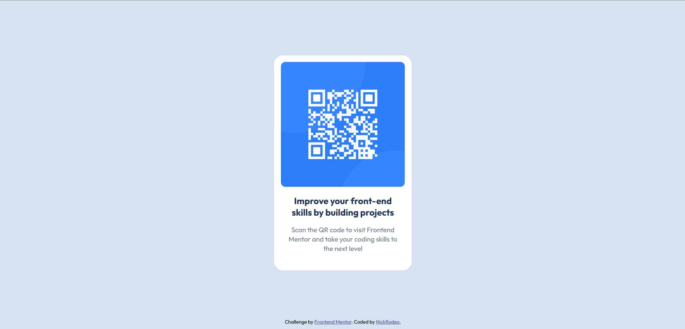

This is a solution to the [QR code component challenge on Frontend Mentor](https://www.frontendmentor.io/challenges/qr-code-component-iux_sIO_H). Frontend Mentor challenges help you improve your coding skills by building realistic projects.

- [Overview](#overview)
  - [Screenshot](#screenshot)
  - [Links](#links)
- [My process](#my-process)
  - [Built with](#built-with)
  - [What I learned](#what-i-learned)
  - [Continued development](#continued-development)
  - [Useful resources](#useful-resources)
- [Author](#author)
- [Acknowledgments](#acknowledgments)

## Overview

This is a challenge about making QR Code Design and really good for beginner like me

### Screenshot

### Links

- Live Site URL: [https://nickrodeo.github.io/Frontendmentor/]

## My process

### Built with

- CSS
- Flexbox
- CSS Grid

### What I learned

I learned about making how to use git and making repo of this simple challenge project and also design little

### Continued development

Try to get better

### Useful resources

- Family: [Outfit](https://fonts.google.com/specimen/Outfit)

## Author

- Website - [NickRodeo]
- Frontend Mentor - [@NickRodeo](https://www.frontendmentor.io/profile/NickRodeo)

## Acknowledgments

I dont know because i just start this challenge
